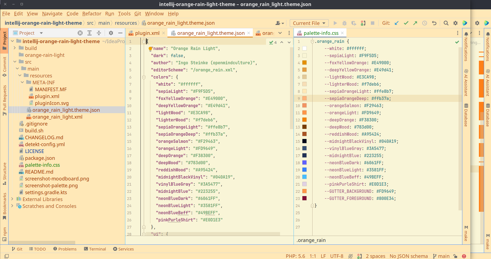
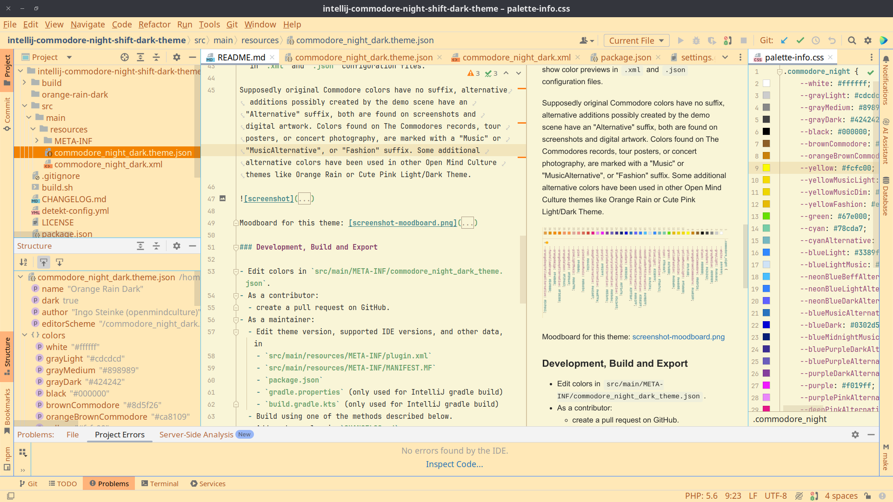
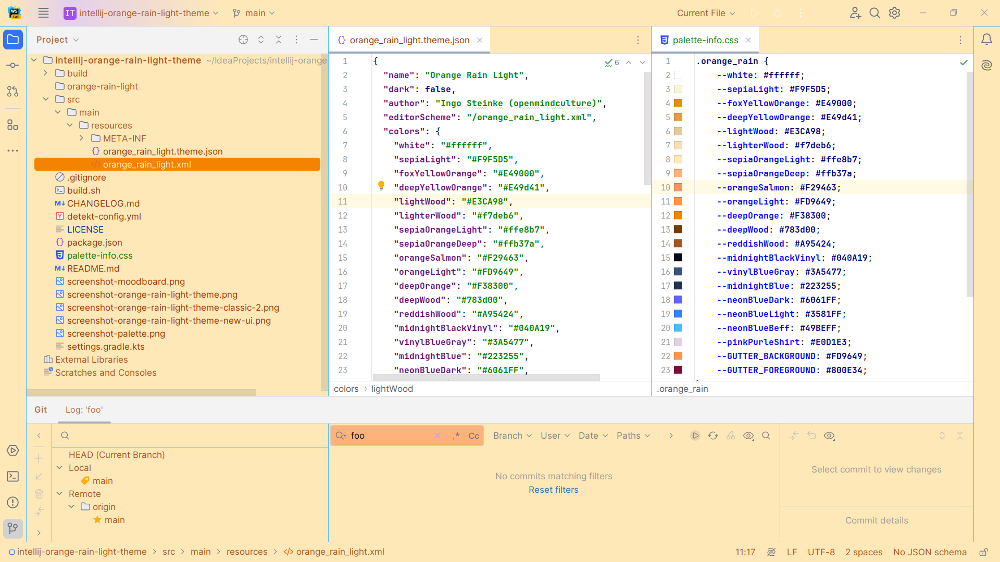
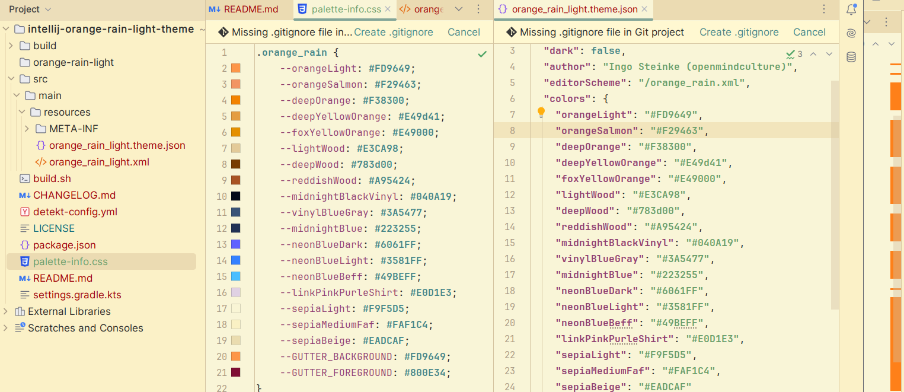

# Orange Rain Light Theme

<!-- Plugin description -->
[Orange Rain Light Theme](https://plugins.jetbrains.com/plugin/23794-orange-rain-light-theme) is a light IDE theme for JetBrains IDEs (PhpStorm, WebStorm, IntelliJ IDEA, etc.), version 2020.2 and above, tested up to 2024.1 (244) EAP and should also support later IDEA versions. Based on Cute Pink Light Theme and JetBrains default light editor scheme. There is also an Orange Rain Dark Theme.

If you like to support development, you can open a pull request on GitHub.

For JetBrains IDEs, 
To install:
- Go to Settings (Preferences) | Plugins, find the theme plugin and install it
- (_or_ download [Orange Rain Light Theme from JetBrains Plugins page](https://plugins.jetbrains.com/plugin/23794-orange-rain-light-theme)) 
- Restart IDE
- Go to Settings (Preferences) | Appearance & Behavior | Appearance and see the Theme dropdown

## Support/Contribution

[Report an issue](https://github.com/openmindculture/intellij-orange-rain-light-theme/issues/new) on or create a pull request [on GitHub](https://github.com/openmindculture/intellij-orange-rain-light-theme/issues/new).

## Screenshots

Classic UI (PhpStorm 2023.3.3)

New UI (WebStorm 2024.1 EAP)

<!-- Plugin description end -->

## Installation

If you only want to install the theme, you do not need this repository.
You can install the theme from JB marketplace (inside your IDE) or install zip file (see below).

### Local Installation

In `build/distributions` there is a zip file that I can manually import into my regular PhpStorm installation (Settings -> Plugins -> Gear Icon -> install plugin from disk).

### Development

The initial settings for the formerly recommended development environment, IntelliJ IDEA Ultimate, as described by JetBrains in the [custom UI theme workflow](https://plugins.jetbrains.com/docs/intellij/themes.html#custom-ui-theme-workflow), has been removed in favor of a simple build script since release 1.0.0. You can also create a zip file manually, see the instructions below.

For creating future theme plugins, you do not need a complex Gradle setup, as there is a new
wizard for creating a UI theme. See:
- https://blog.jetbrains.com/platform/2021/10/themes-in-intellij-based-ides/
- https://plugins.jetbrains.com/docs/intellij/theme-structure.html

> A plugin consisting of a single .jar file is placed in the /plugins directory.
Source: https://plugins.jetbrains.com/docs/intellij/plugin-content.html

To find out the internal names of UI elements, we can now use the [UI inspector](https://blog.jetbrains.com/platform/2021/10/themes-in-intellij-based-ides/#UI_Inspector%EF%BB%BF).

The `.palette-info.css` in the root directory can be used for a better editor preview, if the IDE does not show color previews in `.xml` and `.json` configuration files.

Moodboard for this theme: [screenshot-moodboard.png](screenshot-moodboard.png)

### Development, Build and Export

- Edit colors in `src/main/META-INF/orange_rain_light_theme.json`.
- As a contributor:
  - create a pull request on GitHub.
- As a maintainer:
  - Edit theme version, supported IDE versions, and other data, in 
    - `src/main/resources/META-INF/plugin.xml`
    - `src/main/resources/META-INF/MANIFEST.MF`
    - `package.json`
    - `gradle.properties` (only used for IntelliJ gradle build)
    - `build.gradle.kts` (only used for IntelliJ gradle build)
  - Build using one of the methods described below. 
  - Add a change log in `CHANGELOG.md`. 
  - Add a git tag, create a release, and add the theme zip.
  - Upload the theme zip to JetBrains marketplace.

#### Shell Build

`npm run build`

- requires `bash`/`sh`!
- creates a `build/distributions/intellij-orange-rain-light-theme-x.y.z.zip`

#### Alternative Manual Export (without IntelliJ Build Process)

Create an archive `orange-rain-light-theme-x.y.z.zip` containing:
  - `orange-rain-theme-light-theme/` 
    - `lib/`
      - `intellij-orange-rain-light-theme-x.y.z.jar`
        The `.jar` file is another zip archive containing the contents of `src/main/resources`
        with **no additional folder in between, e.g.:
          - `orange_rain_light.theme.json`
          - `orange_rain_light.xml`
          - `META-INF/`
            - `plugin.xml`
            - `pluginIcon.svg`
            - `MANIFEST.MF`

A valid `MANIFEST.MF` example is included to simplify theme export and update.

You can use the build script `./build.sh $version` to build, e.g.
`./build.sh 2.9.0`

#### Upgrade Plugin for new IDEA versions

- bump plugin version
- add current IDEA version to supported targets
- rebuild artifacts as described above

### Author

I am Ingo Steinke ([@openmindculture](https://github.com/openmindculture) on GitHub) a creative web developer, creating sustainable software and websites. If you like my [talks](https://www.ingo-steinke.com/#talks-events) and articles, feel free to [support me on patreon](https://www.patreon.com/ingosteinke), [buy me a coffee](https://www.buymeacoffee.com/ingosteinke) or [hire me as a freelancer](https://www.ingo-steinke.com/#contact).
